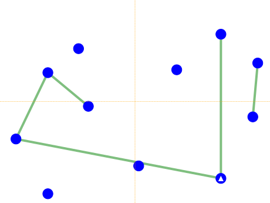
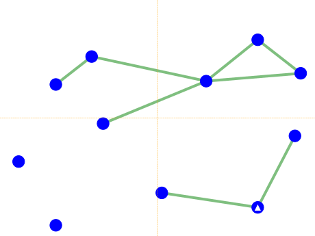
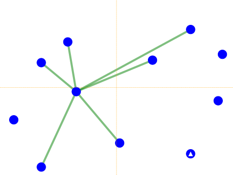
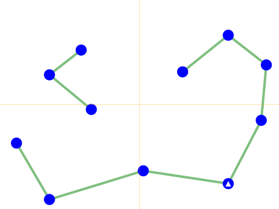
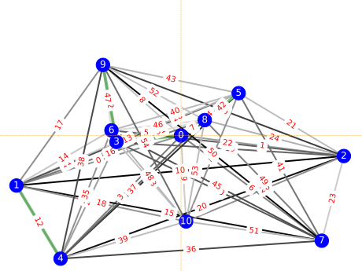

# Path Optimization Using D-Wave Leap

## Prerequisites
- `Python 3` with `pipenv`;
- `Qt5` for cross-platform HiDPI-friendly visualization support via `matplotlib`;
- register at [D-Wave Leap](https://cloud.dwavesys.com/leap/) and obtain corresponding API key;
- configure environment with [dwave CLI](https://docs.ocean.dwavesys.com/en/stable/docs_cli.html#cli-example-config)  providing the API key when asked:
    ```bash
    dwave config create
    ```
- clone this repo 
    ```bash
    git clone https://github.com/godsic/path-optimizer-for-dwave.git && cd path-optimizer-for-dwave
    ```
- configure Python environment with [D-Wave Ocean SDK](https://docs.ocean.dwavesys.com/en/stable/) by running the following command:
    ```bash
    pipenv install
    ```

## Usage
Simply execute 
```bash
pipenv run ./path-optimizer.py
```
and it will display path graph with taken segments highlighted in green.

To see all available options and their default values please execute
```bash
pipenv run ./path-optimizer.py --help
```

## Code Specifics
The problem parameters are

- `L_max` is the maximum travel range
- `p_0` are the $x$ and $y$ coordinates of the origin
- `coordinates_filename` is the file containing 2D coordinates of the targets in $XY$ format

The quality of the solution is determined by

- `l_g` - weight of the goal function;
- `l_I` - weight of number of taken segmets maximizer;
- `l_II` - weight of discontinuous routes penalties;
- `l_III` - weight of the segmets-per-target constrain;
- `l_IV` - weight of starting point constrain.

## The Model

### Goal function

The total traveled distance is 
$$
    L = \sum_{i=0}^N{L_i x_i}
$$
where $L_{i}$ is the length of the $i^{th}$ segment and
$$
x_i = \begin{cases}
    1 & \text{if $i^{th}$ segment is taken} \\
    0 & \text{if $i^{th}$ segment is not taken}
\end{cases}
$$

If $L_{MAX}$ is the travel range, then we arrive at the following goal function
$$
    \sum_{i=0}^N{l_i x_i} - 1 = 0
$$
where $l_i = L_i / L_{MAX}$.

Using identities
$$
    (\sum_{i=0}^N{x_i} - C)^2 = \sum_{i=0}^N{x_i^2} + 2\sum_{i=0}^N{\sum_{j>i}^N{x_i x_j}} - 2 C \sum_{i=0}^N{x_i} + C^2 = 0
$$

$x_i^2 = x_i = x_i x_i$ and omitting constant terms we arrive at the following goal function

$$
    \sum_{i=0}^N{l_i(l_i - 2)x_i x_i} + \sum_{i=0}^N{\sum_{j>i}^N{2 l_i l_j x_i x_j}} 
$$

That corresponds to the following QUBO matrix
$$
Q_{ij}^G = 
\begin{cases}
    l_i(l_i - 2) & \text{$i = j$}\\
    2 l_i l_j & \text{$i \neq j$} 
\end{cases}
$$

Applying the goal model to the example datasets leads to $5$ segments taken with a total distance of $499.942$ units, i.e.:




### Constrain I: Maximize number of segments

The number of segments taken during the trip is given by
$$
    n = \sum_{i=0}^N{x_i}
$$
So the corresponding constraint could be expressed as 
$$
    - \lambda_{I}\sum_{i=0}^N{x_i}
$$
where $\lambda_{I}$ is the Lagrangian parameter. 

So we arrive at following QUBO matrix
$$
Q_{ij}^I = 
\begin{cases}
    -\lambda_{I} & \text{$i = j$}\\
    0 & \text{$i \neq j$} 
\end{cases}
$$

Applying the first constrain to the example datasets leads to $8$ segments taken with a total distance of $497.487$ units, i.e.:



### Constrain II: Penalize discontinuous trips

This could be summarized as follows
$$
    Q_{ij}^{II} = \lambda_{II}\sum_{i=0}^N\sum_{j>i}^N{D_{ik}x_ix_j}
$$
where
$$
D_{ij} = 
\begin{cases}
    0 & \text{if $i$ and $j$ are $incident$}\\
    1 & \text{if $i$ and $j$ are $not\ incident$} 
\end{cases}
$$

Applying only the second constrain to the example datasets leads to $6$ segments taken with a total distance of $492.664$ units, i.e.:



### Constrain III: Every point should be visited only once

If point is visited once, it should contain at most two incident edges (at least one in and maybe one out). This could be expressed as follows

$$
\begin{cases}
    (\sum_j{x_j} - 2)^2 = 0 \\
    (\sum_j{x_j} - 1)^2 = 0
\end{cases}
$$

where summation is over the incident segments of the given point. Adding up both equations and using the identities provided above we arrive at the following QUBO matrix

$$
    Q_{ij}^{III}=
    \begin{cases}
    \lambda_{III} (-2\delta_{ij} + 2 (1 - \delta_{ij}))& \text{if $i$ and $j$ are $incident$} \\
    0 & \text{if $i$ and $j$ are $not\ incident$} 
\end{cases}
$$

which effectively prescribes $1.5$ edges per target. 

Applying only the third constrain to the example datasets leads to $9$ segments taken with a total distance of $513.111$ units and the path is closed as expected, i.e.:



### Constrain IV: Starting point

If the starting node is $s$, then all segments originating from it should be preferred via

$$
    Q_{ij}^{III}=
    \begin{cases}
    - \lambda_{III} \delta_{ij} & \text{if $s \in i$} \\
    0 & \text{if $s \notin i$} 
    \end{cases}
$$

where
$$
D_{ij} = 
\begin{cases}
    0 & \text{if segments $i$ and $j$ are $connected$}\\
    1 & \text{if segments $i$ and $j$ are $not\ connected$} 
\end{cases}
$$

Applying only the second constrain to the example datasets leads to $11$ segments taken with a total distance of $617.784$ units and the path is closed as expected, i.e.:



### Grand Total

Summarizing the above goal and constraints we arrive at the following QUBO matrix
$$
Q_{ij} = Q_{ij}^G + Q_{ij}^I + Q_{ij}^{II} + Q_{ij}^{III} = 
\begin{cases}
    l_i(l_i - 2) - \lambda^{I} & \text{$i = j$}\\
    2 l_i l_j + \lambda^{II}D_{ij} & \text{$i \neq j$} 
\end{cases}
$$
